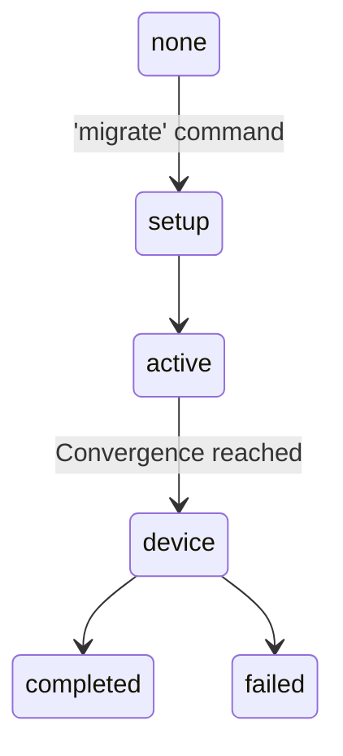
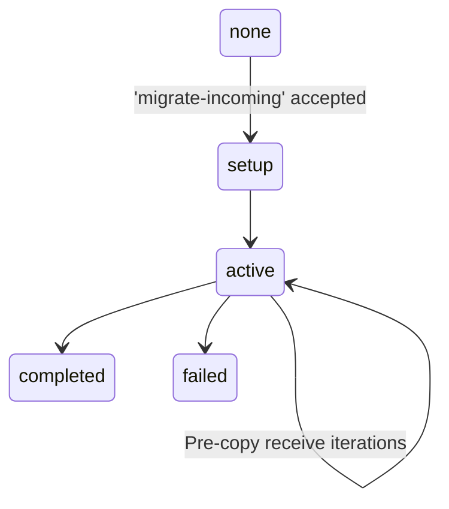
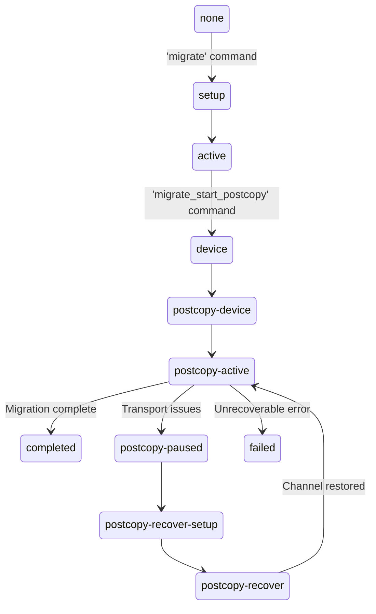
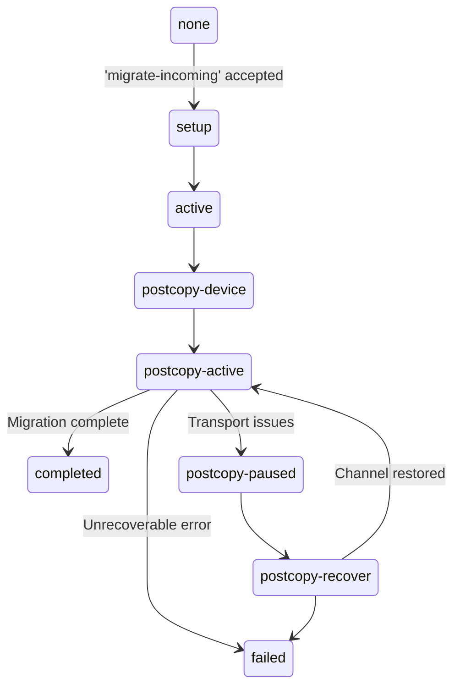
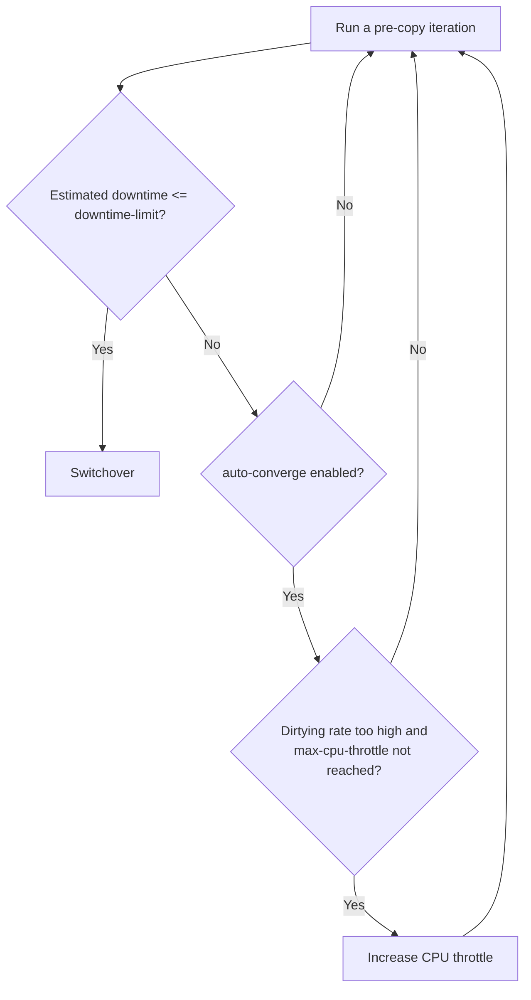
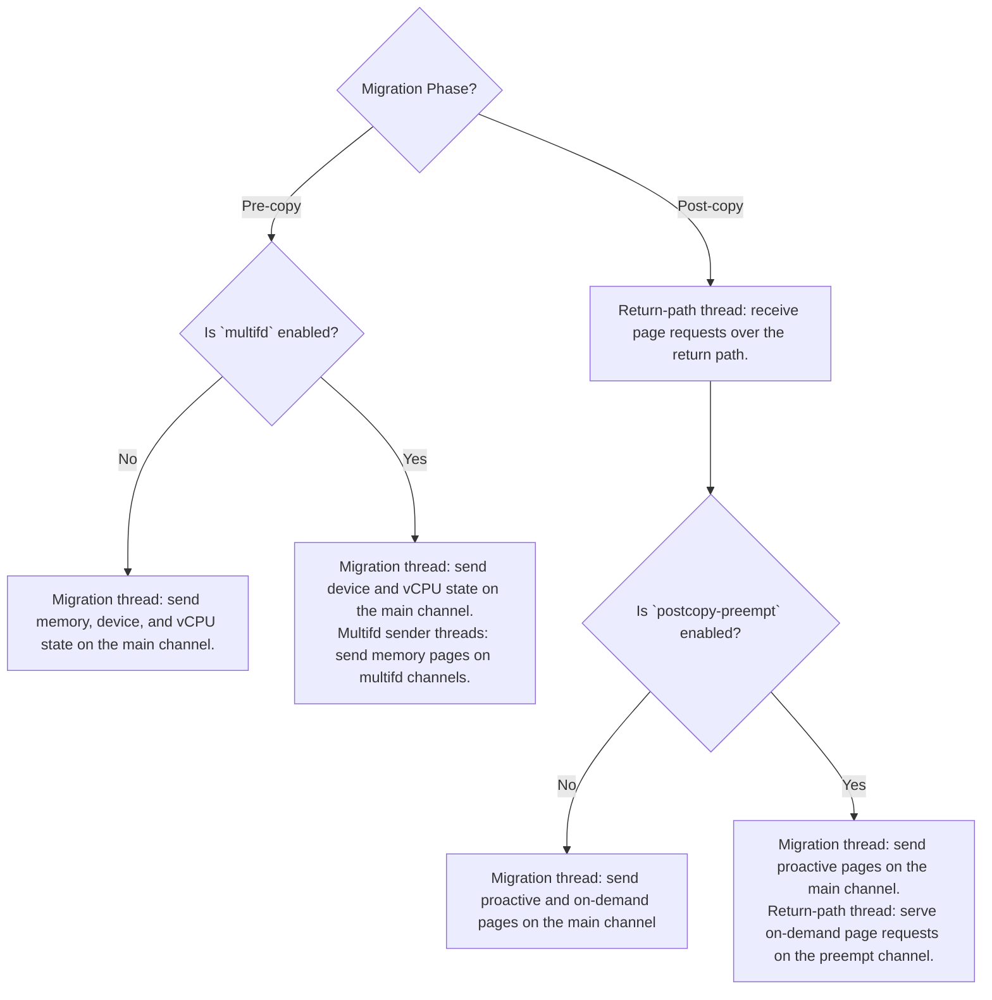
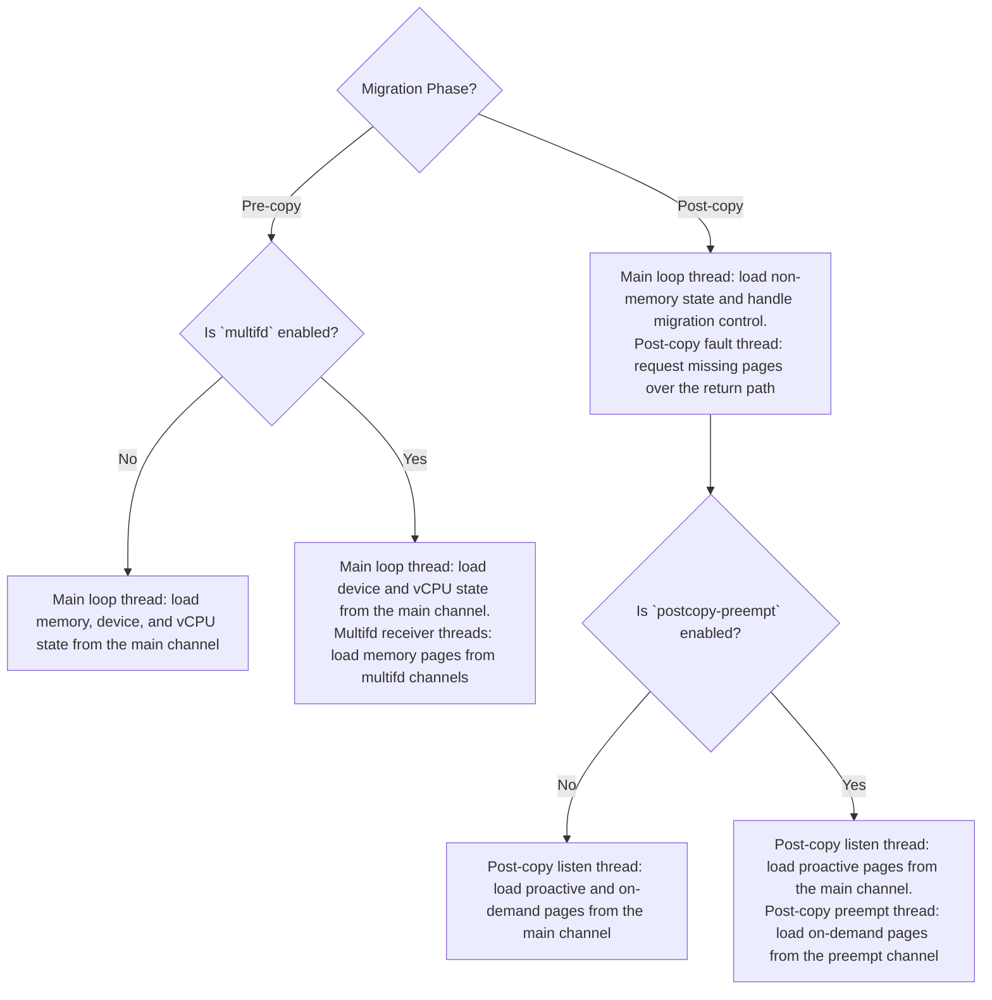

<!--
-*- coding: utf-8 -*-
vim: ts=4 sw=4 tw=100 et ai si

# Copyright (C) 2024-2026 Intel Corporation
# SPDX-License-Identifier: BSD-3-Clause

Author: Artem Bityutskiy <artem.bityutskiy@linux.intel.com>
-->

# QEMU/KVM Live Migration

- **Author**: Artem Bityutskiy
- **Version**: 1.0
- **Date**: 2026-06-05
- **Last updated**: 2026-07-19

**Disclaimer**: This document describes my understanding of QEMU live migration design, not a
comprehensive reference. The focus is on QEMU/KVM and traditional VMs. At the time of writing (June
2026), I had no QEMU, KVM, or virtualization experience. This document contains my study notes. It
is not official QEMU/KVM documentation and is not endorsed by the QEMU project. The document may
contain errors or omissions. It may be expanded over time, and the version number will be updated
accordingly.

---

## Table of Contents

- [QEMU/KVM Live Migration](#qemukvm-live-migration)
  - [Table of Contents](#table-of-contents)
  - [Introduction](#introduction)
    - [Device State](#device-state)
    - [Guest Storage](#guest-storage)
    - [QMP commands](#qmp-commands)
  - [Pre-copy vs Post-copy](#pre-copy-vs-post-copy)
  - [Migration State Machine](#migration-state-machine)
    - [Pre-copy State Machine](#pre-copy-state-machine)
    - [Post-copy State Machine](#post-copy-state-machine)
    - [Error Handling and Recovery](#error-handling-and-recovery)
  - [Guest Memory Data Structures](#guest-memory-data-structures)
    - [MemoryRegion](#memoryregion)
    - [RAMBlock](#ramblock)
    - [KVM Memslot](#kvm-memslot)
    - [KVM Address Space](#kvm-address-space)
    - [KVMSlot](#kvmslot)
  - [Pre-Copy Migration](#pre-copy-migration)
    - [Convergence Algorithm](#convergence-algorithm)
    - [Auto-Converge](#auto-converge)
  - [Memory State Migration](#memory-state-migration)
  - [CPU State Migration](#cpu-state-migration)
  - [Migration Channels](#migration-channels)
  - [QEMU Threads](#qemu-threads)
    - [vCPU Threads](#vcpu-threads)
    - [I/O Threads](#io-threads)
    - [Main Loop Thread](#main-loop-thread)
    - [Migration Thread](#migration-thread)
    - [Return-Path Thread](#return-path-thread)
    - [KVM Dirty Ring Reaper Thread](#kvm-dirty-ring-reaper-thread)
    - [Multifd Sender and Receiver Threads](#multifd-sender-and-receiver-threads)
    - [Post-copy Listen Thread](#post-copy-listen-thread)
    - [Post-copy Preempt Thread](#post-copy-preempt-thread)
    - [Post-copy Fault Thread](#post-copy-fault-thread)
    - [Migration Threads Diagram](#migration-threads-diagram)

---

## Introduction

Live migration is moving a running virtual machine (VM) from one physical host to another with
minimal downtime (on the order of tens to hundreds of milliseconds). This capability is crucial for
physical host maintenance, load balancing, and fault tolerance.

```text
+------------+         +-------------+
|   Source   |         | Destination |
| +--------+ |         | +---------+ |
| |   VM   | |         | |   VM    | |
| +--------+ |         | +---------+ |
|     |      | Network |      |      |
| +--------+ |-------->| +---------+ |
| |  QEMU  | |         | |  QEMU   | |
| +--------+ |         | +---------+ |
|     |      |         |      |      |
| +--------+ |         | +---------+ |
| |  KVM   | |         | |   KVM   | |
| +--------+ |         | +---------+ |
+------------+         +-------------+
```

To start live migration of a VM running on a source host:

- Start a QEMU process on the destination host with a configuration compatible with the source
  host. Use the `-incoming` option to make it wait for an incoming migration request.
- Configure migration parameters on the source host, such as network address and migration mode.
- Initiate the migration process on the source host.
- QEMU on the source host will establish a network connection to the destination host and start
  transferring the VM state, including memory, CPU, and device state.
- After migration completes, the VM runs on the destination host and source host resources are
  freed.

During migration, there is a brief period when the source VM is paused and the destination VM
is not yet running. This period is called the **downtime** or **blackout period**.

**Note**: This document assumes migration between two hosts over the network for simplicity, but
QEMU supports multiple migration transports, for example files and `exec` channels. Source and
destination QEMU can also run on the same physical host.

### Device State

QEMU defines "device state" as non-memory VM state, including vCPU and emulated devices. This
document uses a narrower definition: "device state" means emulated devices only (for example,
virtio-blk). vCPU state and guest memory state are separate categories.

### Guest Storage

The destination VM must be able to reach the storage by the time it starts. But QEMU transfers only
storage driver state, not the actual storage data. Storage availability is handled separately, for
example:

- Shared storage visible to both hosts (e.g., via NFS).
- Storage copied or replicated to the destination ahead of time.
- Synchronized storage using QEMU jobs like `drive-mirror` or `blockdev-mirror` (often via NBD).

### QMP commands

QMP (QEMU Machine Protocol) is QEMU's JSON-based management protocol. Migration-related commands
include, for example:

- `migrate`: start migration (source QEMU)
- `migrate-incoming`: accept incoming migration (destination QEMU)
- `query-migrate`: get migration status and statistics
- `migrate-pause`: pause migration
- `migrate-continue`: continue from a paused state

These commands are typically issued by higher-level management tools like `libvirt` or `virsh`, but
users can also interact directly with QEMU via the human monitor console (HMP), which supports QMP
commands in a human-readable format.

This document uses **operator** to refer to whoever issues QMP or HMP commands: a user or a VM
management tool.

---

## Pre-copy vs Post-copy

QEMU supports two live migration models: pre-copy and post-copy.

- **Pre-copy**: The source VM keeps running while the source QEMU process iteratively copies memory
  to the destination. After several rounds, the source VM is paused, the remaining state is
  transferred, and the destination VM is started.
- **Post-copy**: Migration always starts in pre-copy mode. After one or more pre-copy rounds, the
  operator issues the `migrate_start_postcopy` command to switch modes. The source VM is then
  paused, QEMU transfers CPU and device state to the destination, and starts the destination VM.
  Missing memory pages are fetched on demand when the destination touches them, using the
  `userfaultfd(2)` Linux system call. At the same time, the source keeps sending remaining pages
  proactively, so not all page transfers are triggered by page faults.

The two models also differ in failure handling:

- **Pre-copy**: VM state has clear ownership throughout: on the source before switchover, on the
  destination after. One side always holds the complete state, which makes failure handling simpler.
  If migration fails before switchover, the source VM can resume.
- **Post-copy**: after switchover, VM state is split between source and destination, and neither
  side has a complete runnable state. Failure recovery in this situation is a hard problem in
  general.

---

## Migration State Machine

**Terminology note**: this section describes the live migration state machine, but it uses the
word "phase" for clarity. The word "state" is already used in this document for VM component
state (for example guest memory state, vCPU state, and device state).

Here are the main live migration phases in QEMU, using names from the QEMU `MigrationStatus`
enum.

- **none**: initial phase, no migration has happened yet.
- **setup**: migration has been initiated and setup work is in progress. QEMU is creating the
  migration channels, validating parameters, and preparing resources needed before transfer begins.
- **active**: pre-copy transfer is running. The source VM is still running while source QEMU
  transfers memory in rounds.
- **pre-switchover**: optional paused state before switchover. QEMU enters it only when the
  `pause-before-switchover` capability is enabled. At this point, guest execution has already
  stopped, and QEMU is waiting for the operator to continue into the device phase.
- **device**: the switchover process itself. QEMU is transferring the emulated device and vCPU
  state.
- **completed**: migration finished successfully.
- **cancelling**: cancellation is in progress. QEMU is aborting migration and cleaning up the
  migration context. In most cases this happens when the operator cancels migration. QEMU can also
  trigger cancellation internally in a few cases.
- **cancelled**: cancellation finished. The source VM remains the active copy.
- **failing**: an error occurred and cleanup is still in progress.
- **failed**: migration ended with failure and cleanup is done.

Post-copy specific phases:

- **postcopy-device**: the destination is still loading non-memory VM state and is not running
  yet. If migration fails in this phase, the source can still resume.
- **postcopy-active**: migration is in post-copy mode. The destination VM is already running,
  while missing memory is fetched on demand and remaining pages are sent proactively at the same
  time.
- **postcopy-paused**: post-copy migration is paused, typically because of a transport failure,
  and QEMU is waiting for recovery.
- **postcopy-recover-setup**: setup phase for a post-copy recovery attempt, preparing the new or
  restored migration channel.
- **postcopy-recover**: post-copy recovery is in progress. QEMU is trying to reconnect the two
  sides and continue the interrupted migration.

The following state machine diagrams are intentionally simplified. They omit some states and
transitions (for example, `cancelling`/`cancelled`, intermediate failure handling, and several less
common error-path arrows) and focus on the main migration flow.

### Pre-copy State Machine

Source side:



Destination side:



### Post-copy State Machine

Source side:



Destination side:



### Error Handling and Recovery

When migration is cancelled or fails, QEMU first tries to stop migration cleanly and resume the
source VM. If that is not safe, QEMU leaves the source VM paused and reports failure. The
operator then decides the next step.

For pre-copy, failure handling is generally simpler. The source keeps the full VM state until the
destination VM starts, so QEMU can usually resume the source VM after a cancel or failure.

For post-copy, failure handling is harder. After switchover, memory ownership is split between the
source and destination, and there is no guaranteed rollback to a complete source-side VM. If an I/O
failure happens after the destination VM has started, QEMU can try to recover by re-establishing
the migration channel and continuing migration. If recovery fails, QEMU reports failure. At that
point, the operator has limited options, such as restoring the VM from a backup or snapshot.

---

## Guest Memory Data Structures

This section gives a high-level overview of the main QEMU and KVM data structures used to manage
guest memory, so later sections can use these terms without redefining them.

### MemoryRegion

MemoryRegion is a QEMU structure that describes a guest-visible memory region. QEMU builds the VM
physical memory map from a tree of MemoryRegion objects, then exposes the resulting layout to KVM
as memslots.

For example, a MemoryRegion can represent:

- A RAM region.
- A ROM region.
- An MMIO window.
- An alias, which is an alternate mapping of another MemoryRegion.

MemoryRegion objects do not store a fixed GPA or HVA for the region. Instead, they store metadata
that QEMU uses to build the GPA layout and route accesses either to host-backed memory or to device
MMIO handlers.

A MemoryRegion describes layout, not a fixed mapping. QEMU later flattens the tree into absolute
ranges. This allows for flexible remapping. For example, an MMIO window can move when a device
register changes, and QEMU updates the map without redefining the region.

During migration, source and destination can use different HVA bases for the same guest memory,
and this model handles that naturally.

Some key fields of the `MemoryRegion` structure:

- `addr`: offset in the GPA space, relative to the parent `MemoryRegion` (container).
- `size`: region size.
- `ram_block`: pointer to the corresponding `RAMBlock` object.
- `container` and `subregions`: links used to compose the region tree.

### RAMBlock

RAMBlock is a QEMU structure representing one contiguous host virtual memory allocation used for
guest RAM.

A RAMBlock does not have to match one contiguous guest physical range. The same RAMBlock can be
mapped into one or more guest physical ranges.

Relationship to MemoryRegion: MemoryRegion describes where RAM appears in the guest physical map,
while RAMBlock holds the host allocation that backs that RAM.

Some key fields of the `RAMBlock` structure:

- `mr`: pointer to the corresponding `MemoryRegion`.
- `host`: base HVA of the RAMBlock allocation.
- `used_length`: currently active length of the block.
- `max_length`: maximum configured length of the block.
- `bmap`: source-side dirty pages bitmap for this block.
- `receivedmap`: destination-side bitmap of pages already received.

### KVM Memslot

A memslot is a KVM object that maps one contiguous guest physical range to one host virtual range.
Dirty logging in KVM is tracked per memslot.

Userspace creates and updates memslots with `KVM_SET_USER_MEMORY_REGION` or
`KVM_SET_USER_MEMORY_REGION2` KVM ioctls. One RAMBlock can correspond to one or more memslots.

Relationship to MemoryRegion and RAMBlock: QEMU first flattens MemoryRegion layout into contiguous
guest physical ranges, then maps each range to host memory from RAMBlock. KVM stores each mapping
as a memslot.

### KVM Address Space

A KVM address space is an independent guest physical memory namespace that contains memslots. Each
memslot belongs to one address space.

QEMU usually uses only one address space ID 0. With SMM enabled, QEMU also uses the second address
space for the SMM memory space (ID 1).

### KVMSlot

KVMSlot is a QEMU bookkeeping object for one KVM memslot. Among other fields, it stores cached
dirty page information for that memslot.

---

## Pre-Copy Migration

Pre-copy migration transfers VM state while the guest continues running on the source host. The
process is iterative. QEMU sends memory in rounds, and each round transfers pages that were
modified since the previous round (dirty pages).

QEMU maintains dirty pages bitmap in userspace with one bit per guest memory page. The bitmap is
organized per RAMBlock. QEMU uses KVM dirty tracking to update this bitmap.

**Terminology**: page protection means putting a page into the "track the next write" state.
Depending on Linux and hardware configuration, KVM can do it in different ways. One way is
write-protecting the page in the EPT entry so the next write is trapped. Another way is based on
the EPT dirty bit, where KVM clears the bit so the next write sets it again.

There are two main KVM dirty tracking methods:

- Bitmap method (default): QEMU gets dirty page information via `KVM_GET_DIRTY_LOG`.
- Dirty ring method: QEMU reads per-vCPU dirty ring entries.

In bitmap method, QEMU can choose between two modes of page protection:

- Automatic page protection: `KVM_GET_DIRTY_LOG` returns dirty pages and KVM re-arms tracking
  automatically.
- Manual page protection: QEMU enables `KVM_CAP_MANUAL_DIRTY_LOG_PROTECT2`, reads dirty
  information, then explicitly re-arms tracking for selected pages via `KVM_CLEAR_DIRTY_LOG`.
  Benefit: QEMU can delay re-protection until just before sending pages, which reduces dirty
  tracking overhead on pages that are already known dirty. Clean pages remain tracked, so new dirty
  pages are not missed.

In pre-copy migration, QEMU runs the following steps:

- Initialize the RAMBlock migration bitmap with all guest RAM pages marked dirty, so every
  page is sent in the first iteration.
- Enable KVM dirty tracking for all memslots.
  - Bitmap API with automatic page protection: KVM enables dirty logging and write-protects pages
    for tracking.
  - Bitmap API with manual page protection: with `KVM_DIRTY_LOG_INITIALLY_SET`, pages start dirty and
    get protected later when QEMU explicitly applies page protection to selected pages.
  - Dirty ring API: KVM enables dirty-ring logging and write-protects pages for tracking.
- Send all guest RAM pages to the destination in the first iteration. As each page is sent,
  QEMU clears that page in the RAMBlock migration bitmap. Meanwhile, the VM continues running, and
  KVM tracks dirty pages in memslots.
- Collect dirty page information from KVM memslots and merge it into the RAMBlock migration bitmap.
  - Bitmap API with automatic page protection: `KVM_GET_DIRTY_LOG` returns dirty pages and also
    applies page protection.
  - Bitmap API with manual page protection: QEMU gets dirty pages, then later applies page
    protection to selected pages with `KVM_CLEAR_DIRTY_LOG`.
  - Dirty ring API: QEMU collects dirty ring entries, then re-arms tracking when rings are reset.
- Send dirty pages, and clear them from the RAMBlock migration bitmap.
- Repeat the previous two steps until convergence is reached or the operator decides to switch to
  post-copy.
- Disable KVM dirty tracking for memslots.

### Convergence Algorithm

The convergence algorithm decides when pre-copy should stop iterating and move to switchover.

After each iteration, QEMU checks how much dirty memory is still left and estimates whether it can
be sent within the allowed downtime. If yes, QEMU stops pre-copy iterations and proceeds to
switchover. If not, QEMU runs another pre-copy iteration.

The allowed downtime is a user-configurable parameter (`downtime-limit`, default 300 ms).
QEMU compares it with the estimated downtime. The estimate is based on remaining dirty bytes
and bandwidth, using measured migration bandwidth by default. If the operator sets
`avail-switchover-bandwidth`, QEMU uses that value instead of measured bandwidth for
switchover estimation. This setting changes only the switchover decision logic. It does not
limit migration traffic bandwidth.

### Auto-Converge

- QEMU periodically compares the guest memory dirtying rate with the effective migration transfer
  rate.
- If the dirtying rate is too high on repeated checks, QEMU increases CPU throttle.
  - Note: QEMU compares dirtying rate against transfer rate multiplied by the
    `throttle-trigger-threshold` percentage. The default threshold is 50%, so dirtying rate is
    compared against 50% of transfer rate.
- CPU throttle starts from 20% (configurable via `cpu-throttle-initial`).
- On each trigger, throttle increases by 10% (configurable via `cpu-throttle-increment`), up to
  99% (configurable via `max-cpu-throttle`).
- As guest CPU execution slows down, the dirty rate may drop enough for convergence, and QEMU
  proceeds to switchover.

If `auto-converge` is disabled, QEMU does not throttle the guest CPU. If the dirty rate stays too
high, pre-copy iterations just continue.

If `auto-converge` is enabled but throttle has already reached `max-cpu-throttle` and convergence
still does not happen, pre-copy iterations also continue.

In both cases, the operator is supposed to intervene, for example cancel migration, request
post-copy migration, or adjust migration parameters, such as `downtime-limit`.



---

## Memory State Migration

Before RAM transfer begins, the destination QEMU already has guest RAM allocated as RAMBlocks. The
backing can come from different memory backends, for example anonymous mappings, file-backed
memory, `memfd`, or POSIX shared memory. It also has a compatible guest physical memory layout
built from `MemoryRegion` objects, and the corresponding KVM memslots created with
`KVM_SET_USER_MEMORY_REGION` or `KVM_SET_USER_MEMORY_REGION2`.

During migration, the source QEMU uses dirty page tracking. The source QEMU reads guest memory
directly from its address space, and the destination QEMU writes it directly to RAMBlocks in
userspace. There are no special KVM ioctls for per-page guest memory reads or writes.

---

## CPU State Migration

The CPU state is transferred at switchover, when the source VM is paused.

In QEMU, x86 CPU state is represented by the `CPUX86State` structure, which contains
substructures and fields for CPU registers, model-specific registers (MSRs), and other
architectural CPU state. For example:

```c
    target_ulong regs[CPU_NB_EREGS];
    target_ulong eip;
    target_ulong cr[5];
    uint64_t msr_ia32_feature_control;
```

For KVM-accelerated x86 VMs, QEMU reads and restores most architectural vCPU state using KVM
ioctls. The following list is illustrative, not exhaustive:

- `KVM_GET_REGS` / `KVM_SET_REGS`: general-purpose registers and RFLAGS
- `KVM_GET_SREGS` / `KVM_SET_SREGS`: segment registers, control registers, interrupt tables
- `KVM_GET_MSRS` / `KVM_SET_MSRS`: model-specific registers
- `KVM_GET_LAPIC` / `KVM_SET_LAPIC`: local APIC state
- `KVM_GET_VCPU_EVENTS` / `KVM_SET_VCPU_EVENTS`: pending exceptions and interrupts
- `KVM_GET_DEBUGREGS` / `KVM_SET_DEBUGREGS`: debug registers
- `KVM_GET_XSAVE` / `KVM_SET_XSAVE`: extended processor state (XSAVE areas)
- `KVM_GET_XCRS` / `KVM_SET_XCRS`: extended control registers
- `KVM_GET_MP_STATE` / `KVM_SET_MP_STATE`: KVM vCPU state information

---

## Migration Channels

QEMU uses several migration channels. Some are always present, and some are optional.

- **Main channel**: the primary source-to-destination channel. It carries VM state data (memory,
  device, and vCPU state) and is always present.
- **Multifd channels** (optional): additional source-to-destination channels used when the `multifd`
  capability is enabled. They carry memory pages in parallel, and in some cases also carry device
  state.
- **Return path**: a destination-to-source channel that carries control and coordination messages,
  including page requests in post-copy and completion status back to the source. It is optional in
  pre-copy (`return-path` capability) and always present in post-copy.
- **Preempt channel** (optional, post-copy only): a dedicated source-to-destination channel used
  when the `postcopy-preempt` capability is enabled. It carries on-demand pages requested by the
  destination after page faults, while regular proactive page transfer continues on the main
  channel.

---

## QEMU Threads

QEMU runs as a single process with multiple threads that share the same address space, file
descriptors, and other resources.

This section starts by describing the vCPU and I/O threads, which are not the primary migration
data-path threads. Then it provides an overview of migration-related threads.

### vCPU Threads

In QEMU, each virtual CPU (vCPU) is represented by a separate thread. In KVM-accelerated VMs, the
vCPU thread is effectively a loop running the `KVM_RUN` ioctl and handling VM exits that return to
userspace.

### I/O Threads

By default, QEMU runs all device emulation and I/O in the main loop thread, which can become a
scalability bottleneck. I/O threads (`IOThread`) are optional dedicated event loop threads that
allow handling I/O of some devices outside the main loop.

I/O threads must be created explicitly with `-object iothread,id=<id>` and assigned to a device
with `-device ...,iothread=<id>`. Virtio devices such as `virtio-blk` and `virtio-net` support this.

### Main Loop Thread

The main loop thread is QEMU's central control thread with many responsibilities, for example
handling operator commands, processing timer and event-loop callbacks, and handling signals.

During migration on the source side, the main loop thread handles migration control commands.

During migration on the destination side, it handles the `migrate-incoming` command. In pre-copy,
when `multifd` is disabled, the main loop thread loads both memory and device state from the main
channel. In post-copy, it loads non-memory state and handles migration control commands, while
post-copy RAM loading is handled by dedicated post-copy threads.

### Migration Thread

The migration thread is responsible for reading the source VM state and sending it to the
destination. It is created on the source QEMU as part of `migrate` command handling.

In pre-copy, when `multifd` is disabled, this thread iteratively sends memory on the main channel
while the source VM is still running. At switchover, when the source VM is paused, it sends the
remaining state. When `multifd` is enabled, multifd sender threads send memory pages on the multifd
channels. The migration thread sends device and vCPU state on the main channel.

In post-copy, the migration thread sends remaining memory pages. It also handles on-demand page
requests when `postcopy-preempt` capability is disabled.

### Return-Path Thread

The return-path thread runs on the source QEMU and handles messages that flow from destination to
source over the return path. Examples include `PONG` keep-alives, `REQ_PAGES` page requests,
and other control messages.

When `postcopy-preempt` is enabled, this thread also serves on-demand page requests directly. This
is an optimization because it is faster to provide pages from the same thread that receives the
requests.

The return-path thread is always used in post-copy migration. In pre-copy migration, it is optional
and controlled by the `return-path` capability. If the return path is disabled, there is no
reverse channel in pre-copy, and the migration thread continues sending pages on the main channel
without destination feedback until it decides to start the switchover.

### KVM Dirty Ring Reaper Thread

This thread is used only when QEMU uses the dirty ring KVM interface, which is not the default
configuration. In the default bitmap mode, QEMU does not create this thread.

When dirty ring mode is enabled, QEMU creates a dedicated reaper thread on the source side to
periodically drain per-vCPU dirty ring entries and fold them into QEMU's userspace dirty page
tracking, so later pre-copy iterations can resend pages dirtied by the guest.

### Multifd Sender and Receiver Threads

When the `multifd` capability is enabled, QEMU creates multiple parallel data channels and a pair of
multifd sender and receiver threads for each channel. In pre-copy, the multifd threads handle memory
page transfer, while the migration thread continues handling device state transfer. In post-copy,
the multifd RAM threads are not used.

Devices that implement a special handler can also be migrated in parallel by the multifd threads.
This is mainly used for VFIO migration.

### Post-copy Listen Thread

The post-copy listen thread runs on the destination QEMU in post-copy migration. It receives and
loads incoming memory pages from the main channel. This includes regular proactive pages, and also
on-demand pages when `postcopy-preempt` is disabled.

### Post-copy Preempt Thread

When the `postcopy-preempt` capability is enabled, QEMU also runs a post-copy preempt thread on the
destination side. This thread receives on-demand pages on a dedicated preempt channel and loads them
into guest memory. Its purpose is to reduce page-fault latency.

### Post-copy Fault Thread

The post-copy fault thread runs on the destination QEMU in post-copy migration. It waits for page
miss events from `userfaultfd` and requests the needed pages from the source over the return path.
It does not load pages itself. Requested pages are loaded by the post-copy listen thread on the
main channel, or by the post-copy preempt thread on the preempt channel when enabled.

### Migration Threads Diagram

Here are source and destination side diagrams of migration-related threads and their relation to
migration channels.

Source side diagram.



Destination side diagram.


